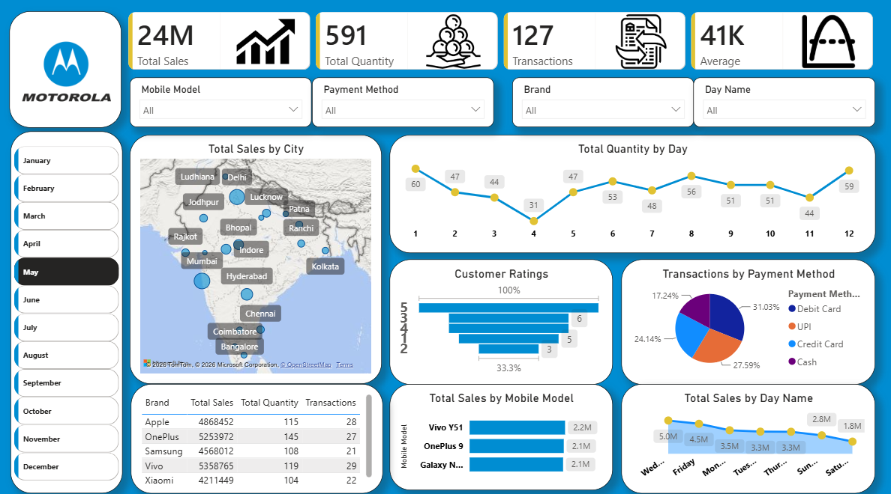

# 📱 Mobile Sales Data Analysis - Power BI Dashboard

## 📌 Project Overview
This project transforms a complex dataset of mobile phone sales into a fully interactive Business Intelligence Dashboard. The objective is to provide actionable insights regarding geographical sales distribution, consumer payment behavior, and brand performance.

## 📊 Dashboard Snapshot

## 💡 Key Business Insights Extracted
*   **Geospatial Sales Mapping:** Identified high-demand cities to optimize distribution networks.
*   **Payment Method Breakdown:** Analyzed consumer buying behavior across UPI, Debit Cards, Credit Cards, and Cash.
*   **Brand Performance:** Compared top-tier brands (Apple, OnePlus, Samsung, Xiaomi) against total revenue and quantities sold.
*   **Time-Series Analysis:** Tracked daily sales trends to spot peak purchasing periods.

## ⚙️ Technical Skills Applied
*   **Data Modeling & Architecture**
*   **DAX (Data Analysis Expressions)** for custom logic and calculations.
*   **Interactive UI/UX Design** with dynamic slicers and map visuals.

## 🚀 How to Use This Dashboard
1. Download the `.pbix` file from this repository.
2. Open it in Microsoft Power BI Desktop.
3. Use the slicers on the left panel and top bar to interact with the data dynamically.
